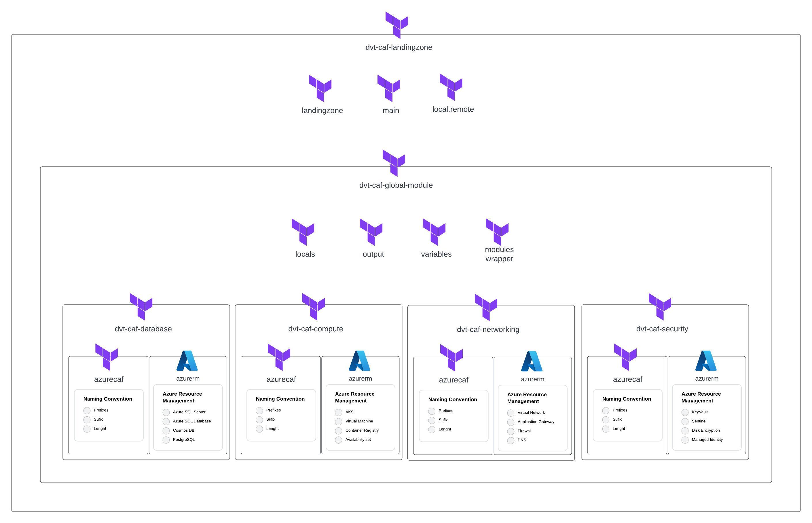

# Budget Thuis Azure Landing Zone

## Intro

This repo contains the terraform code to implement an Azure Landing Zone to Budget Thuis. The modules are developmed using the Microsoft Cloud Adoption Framework for Azure. To get more details follow the link: https://learn.microsoft.com/en-us/azure/cloud-adoption-framework/

This code is based on the terraform-azurerm-caf module: https://github.com/aztfmod/terraform-azurerm-caf


## Development Workspace requirements
 - Terraform
 - Visual Studio Code
 - Git Client


## The project structure
```
📦budget-thuis-lz 
 ┣ 📂src
 ┃ ┣ 📂caf
 ┃ ┃ ┣ 📂core
 ┃ ┃ ┗ 📂workload
 ┃ ┃ ┃ ┣ 📂nonprod 
 ┃ ┃ ┃ ┃ ┣ 📜landing-zone.tfvars
 ┃ ┃ ┃ ┃ ┣ 📜main.tf 
 ┃ ┃ ┃ ┃ ┗ 📜variables.tf
 ┃ ┃ ┃ ┗ 📂prod
 ┃ ┗ 📂dvt-caf
 ┃ ┃ ┣ 📂modules
 ┃ ┃ ┃ ┣ 📂[module_name]
 ┃ ┃ ┃ ┃ ┣ 📜main.tf
 ┃ ┃ ┃ ┃ ┣ 📜output.tf
 ┃ ┃ ┃ ┃ ┣ 📜variables.tf
 ┃ ┃ ┃ ┃ ┣ 📂[submodule_name]
 ┃ ┃ ┃ ┃ ┃ ┣ 📜main.tf
 ┃ ┃ ┃ ┃ ┃ ┣ 📜output.tf
 ┃ ┃ ┃ ┃ ┃ ┣ 📜variables.tf
 ┃ ┃ ┣ 📜local.remote_objects.tf
 ┃ ┃ ┣ 📜locals.combined_objects.tf
 ┃ ┃ ┣ 📜locals.tf
 ┃ ┃ ┣ 📜main.tf
 ┃ ┃ ┣ 📜module.tf
 ┃ ┃ ┣ 📜output.tf
 ┃ ┃ ┣ 📜variables.tf
 ┃ ┃ ┗ 📜[module_wrapper_name].tf
 ┣ 📜.gitignore
 ┗ 📜README.md
```
 - 📂[module_name] - The module folder contains the terraform configuration to an specific azure resources.
 - 📂[submodule_name] - The submodule folder contains the terraform configuration to an specific "sub-resource" like an subnet is part of a virtual network.
 - 📜[module_wrapper_name].tf - The module wrapper is to improve the code reuse and organize the creation of resources from a same type. 

## Architecture



See details: [Lucid Chart](https://lucid.app/lucidchart/8214442d-934b-49cc-a34c-5924447475e0/edit?viewport_loc=-2324%2C-843%2C5450%2C2591%2C0_0&invitationId=inv_5c53211b-8739-42af-b48f-d0e178efcb95)

## Resources naming convention

The naming convention of this project is based on the Cloud Adoption Framework for Azure - Terraform module, using the "azurecaf_name" resource, to configure a standard naming convention across the landing zones. See the documentation [here](https://github.com/aztfmod/terraform-azurerm-caf/blob/main/documentation/conventions.md). 

## Setup the Landing Zone

- Configure the backend (remote tfstate)

### The main.tf file

``` 
module "dvt-caf" {
    source = "../../../dvt-caf"    
    providers = {
        //Add the Alias to the provider
        azurerm.vhub = azurerm.vhub
    }

    //The Global Settings
    global_settings = var.global_settings
    
    //Add the Landing Zone Resource Groups
    resource_groups = var.resource_groups
    
    logged_user_objectId = var.service_principal_id    
    current_landingzone_key = var.landing_zone_key
    tenant_id = var.tenant_id
    
    // Add the Azure Resources using dynamic variables
    keyvaults = var.keyvaults
}
```

### The "variables.tf" file

The variables file is basically a template of wich data will be passed to the module using the .tfvars file.

``` 
variable "global_settings" {
}

variable "resource_groups" {
  default = {}
}

variable "keyvaults" {
  default = {}
}
```

### The "landing-zone.tfvars" file


This file has the settings, and the resources contained in the landing zone, this is a sample file with only one resource group and one key vault. The global_settings object has the naming convetion configurationa and the default and available regions to this landing zone. Inside each resource configuration is possible to refer the region that you want to put your resource.

``` 
global_settings = {       
    random_length  = 4
    default_region = "region1"      
    regions = {
      region1 = "westeurope"
      region2 = "northeurope"
    }
}

resource_groups = {
    rg_main_group = {
        name = "dvt-lz-nonprod"
        region = "region1"
    }
}

keyvaults = {
    nonprodkv01 = {
        name               = "secrets"
        resource_group_key = "rg_main_group"
        sku_name           = "standard"
    }
}
```


### Global Configuration

The global_setting referenced in the Devoteam CAF Module is necessary to provide a set of standards to the landing zone resources, based on the Microsoft Cloud Adoption framework.


## Getting Started


## Landing Zone configuration

```
landingzone = {
    name = "LANDING_ZONE_NAME" 
}

```


