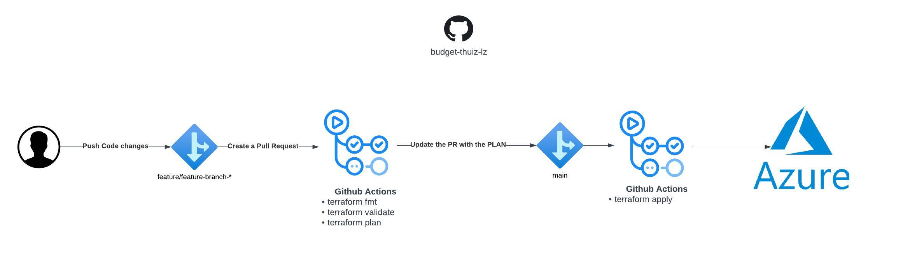
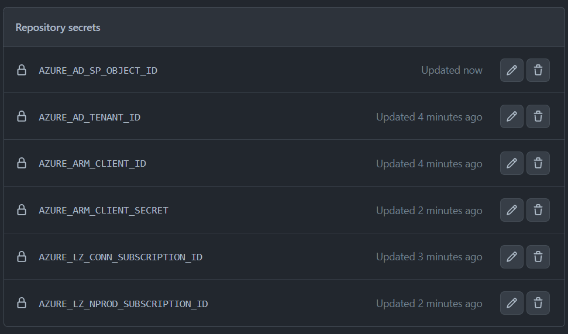

# CAF Demo Azure Landing Zone

## Intro

This repo contains the terraform code to implement an Azure Landing Zone. The modules are developmed using the Microsoft Cloud Adoption Framework for Azure. To get more details follow the link: https://learn.microsoft.com/en-us/azure/cloud-adoption-framework/

This code is based on the terraform-azurerm-caf module: https://github.com/aztfmod/terraform-azurerm-caf


## Development workspace requirements
 
 - Terraform
 - Visual Studio Code
 - Git Client
 - Azure CLI


## Architecture


See details: [Lucid Chart](https://lucid.app/lucidchart/8214442d-934b-49cc-a34c-5924447475e0/edit?viewport_loc=-2324%2C-843%2C5450%2C2591%2C0_0&invitationId=inv_5c53211b-8739-42af-b48f-d0e178efcb95)


## Resources naming convention

The naming convention of this project is based on the Cloud Adoption Framework for Azure - Terraform module, using the "azurecaf_name" resource, to configure a standard naming convention across the landing zones. See the documentation [here](https://github.com/aztfmod/terraform-azurerm-caf/blob/main/documentation/conventions.md). 


## Setup the Remote State

  - Create the service principal

  - Create the storage account to the remote state
  
  - Add the secrets values to the pipeline 
  
  - Configure the Landing Zones .tfbackend files with the remote state backend configuration


## Setup the Landing Zone

### Global Settings

The Global Settings are used to define the naming convention and global settings to create an standard across all the landing zones.


```hcl

global_settings = {
  passthrough = false /* */
  inherit_tags = false /* */
  random_length = 0 /* The number of random characters attached to the resource name */
  prefix = "caf" /* The prefix used to name all resources */
  default_region = "region1" /* The Default Region Key */
  regions = {
    region1 = "westeurope" /* The Primary Region */
    region2 = "northeurope" /* The Secondary Region */
  }
}

```


### Configure the Landing Zone


```hcl

landingzone = {
  backend_type = "azurerm"
  key          = "connectivity"
  environment  = "production"
  tfstates = {
    /* Why ? - */
    current = {      
      storage_account_name = "uzexstconnctivityeoui"
      container_name       = "tfstate"
      resource_group_name  = "uzex-rg-caf-connectivity-syhw"
      key                  = "caf_connectivity.tfstate"      
    }
  }
}

```


## The Terraform Pipelines


### The Continuous Deployment workflow



The Pipelines are configured to run when a Pull Request is openend, and when the Merge is Approved to Main. The firts one to plan and validate and the second one to apply the changes.


### Environment variables

To configure the ARM provider the service principal, tenant and subscription is necessary, and to use it on the pipeline the secrets on GitHub Action are needed:





The Environment variables in the pipeline:

```yaml
env:
  ARM_CLIENT_ID: ${{ secrets.AZURE_ARM_CLIENT_ID }}
  ARM_CLIENT_SECRET: ${{ secrets.AZURE_ARM_SECRET }}
  ARM_SUBSCRIPTION_ID: ${{ secrets.AZURE_LZ_NPROD_SUBSCRIPTION_ID }}
  ARM_TENANT_ID: ${{ secrets.AZURE_AD_TENANT_ID }}
  AZURE_AD_SP_OBJECT_ID: ${{ secrets.AZURE_AD_SP_OBJECT_ID }}  

```


### Pipeline

The Terraform pipeline will plan and apply the infrastruture using CI/CD principles, the code of the Connectivity Landing Zone Pipeline demo is:

```yaml 

name: 'Connectivity Landing Zone'
on:
  push:      
    branches:
      - main
    paths:
      - '**/landingzones/core/connectivity/*.*' 
  pull_request:
    paths:
      - '**/landingzones/core/connectivity/*.*' 

permissions:
  contents: read
  pull-requests: write

env:
  ARM_CLIENT_ID: ${{ secrets.AZURE_ARM_CLIENT_ID }}
  ARM_CLIENT_SECRET: ${{ secrets.AZURE_ARM_SECRET }}
  ARM_SUBSCRIPTION_ID: ${{ secrets.AZURE_LZ_CONN_SUBSCRIPTION_ID }}
  ARM_TENANT_ID: ${{ secrets.AZURE_AD_TENANT_ID }}
  AZURE_AD_SP_OBJECT_ID: ${{ secrets.AZURE_AD_SP_OBJECT_ID }}  

jobs:
  terraform:
    name: 'Terraform - Connectivity Landing Zone'
    runs-on: ubuntu-latest
    environment: non production      
    # Use the Bash shell regardless whether the GitHub Actions runner is ubuntu-latest, macos-latest, or windows-latest
    defaults:
      run:
        shell: bash

    steps:
    # Checkout the repository to the GitHub Actions runner
    - name: Checkout
      uses: actions/checkout@v3

    # Install the latest version of Terraform CLI and configure the Terraform CLI configuration file with a Terraform Cloud user API token
    - name: Setup Terraform
      uses: hashicorp/setup-terraform@v1
      with:
        cli_config_credentials_token: ${{ secrets.TF_API_TOKEN }}

    # Initialize a new or existing Terraform working directory by creating initial files, loading any remote state, downloading modules, etc.
    - name: Terraform Format
      id: fmt
      run: terraform fmt -check
      working-directory: './src/devoteam-modules/dvt-caf-landingzones'

    - name: Terraform Init
      id: init
      run: terraform init -backend-config "../../landingzones/core/connectivity/connectivity.tfbackend" 
      working-directory: './src/devoteam-modules/dvt-caf-landingzones'

    # Generates an execution plan for Terraform
    - name: Terraform Plan
      id: plan
      run: |
        terraform plan -no-color -var-file "../../landingzones/global-settings.tfvars"  \
         -var-file "../../landingzones/core/connectivity/landingzone.tfvars" \
         -var-file "../../landingzones/core/connectivity/network_security.tfvars" \
         -var 'logged_aad_app_objectId=${{ env.AZURE_AD_SP_OBJECT_ID }}'  
      working-directory: './src/devoteam-modules/dvt-caf-landingzones'
      continue-on-error: true
      
    - name: Update Pull Request
      uses: actions/github-script@v6
      if: github.event_name == 'pull_request'
      env:
        PLAN: "terraform\n${{ steps.plan.outputs.stdout }}"
      with:
        github-token: ${{ secrets.GITHUB_TOKEN }}
        script: |
          const output = `#### Terraform Format and Style  - \`${{ steps.fmt.outcome }}\`
          #### Terraform Initialization - \`${{ steps.init.outcome }}\`
          #### Terraform Plan - \`${{ steps.plan.outcome }}\`          

          <details><summary>Show Plan</summary>

          \`\`\`\n
          ${process.env.PLAN}
          \`\`\`

          </details>

          *Pushed by: @${{ github.actor }}, Action: \`${{ github.event_name }}\`*`;

          github.rest.issues.createComment({
            issue_number: context.issue.number,
            owner: context.repo.owner,
            repo: context.repo.repo,
            body: output
          })

    - name: Terraform Apply
      id: apply
      if: github.ref == 'refs/heads/main' && github.event_name == 'push'
      run: |
        terraform apply -var-file "../../landingzones/global-settings.tfvars" \
        -var-file "../../landingzones/core/connectivity/landingzone.tfvars" \
        -var-file "../../landingzones/core/connectivity/network_security.tfvars" \
        -var 'logged_aad_app_objectId=${{ env.AZURE_AD_SP_OBJECT_ID }}' -auto-approve      
      working-directory: './src/devoteam-modules/dvt-caf-landingzones'
      
     

```
 


