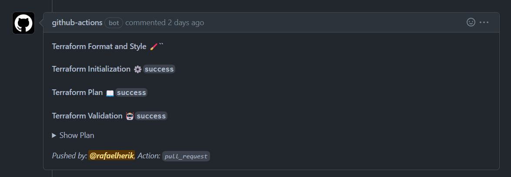

# Budget Thuis Azure Landing Zone

## Intro

This repo contains the terraform code to implement an Azure Landing Zone to Budget Thuis. The modules are developmed using the Microsoft Cloud Adoption Framework for Azure. To get more details follow the link: https://learn.microsoft.com/en-us/azure/cloud-adoption-framework/

This code is based on the terraform-azurerm-caf module: https://github.com/aztfmod/terraform-azurerm-caf


## Development Workspace requirements
 - Terraform
 - Visual Studio Code
 - Git Client


## Architecture


See details: [Lucid Chart](https://lucid.app/lucidchart/8214442d-934b-49cc-a34c-5924447475e0/edit?viewport_loc=-2324%2C-843%2C5450%2C2591%2C0_0&invitationId=inv_5c53211b-8739-42af-b48f-d0e178efcb95)


## Resources naming convention

The naming convention of this project is based on the Cloud Adoption Framework for Azure - Terraform module, using the "azurecaf_name" resource, to configure a standard naming convention across the landing zones. See the documentation [here](https://github.com/aztfmod/terraform-azurerm-caf/blob/main/documentation/conventions.md). 


## Setup the Remote State

  - Create the service principal

  - Create the storage account to the remote state
  
  - Add the secrets values to the pipeline 


## Setup the Landing Zone

### Global Settings

The Global Settings are used to define the naming convention and global settings to create an standard across all the landing zones.


```hcl

global_settings = {
  passthrough = false /* */
  inherit_tags = false /* */
  random_length = 0 /* The number of random characters attached to the resource name */
  prefix = "caf" /* The prefix used to name all resources */
  default_region = "region1" /* The Default Region Key */
  regions = {
    region1 = "westeurope" /* The Primary Region */
    region2 = "northeurope" /* The Secondary Region */
  }
}

user_type = "service-principal" /* The user type used to interact to the backend */


```


### Configure the Landing Zones


```hcl

landingzone = {
  backend_type = "azurerm"
  key          = "connectivity"
  environment  = "production"
  tfstates = {
    current = {      
      storage_account_name = "uzexstconnctivityeoui"
      container_name       = "tfstate"
      resource_group_name  = "uzex-rg-caf-connectivity-syhw"
      key                  = "caf_connectivity.tfsate"
      tenant_id            = "[SENSITIVE]" /* OPTIONAL - If is null the environment variable will be used*/
      subscription_id      = "[SENSITIVE]" /* OPTIONAL - If is null the environment variable will be used */
    }
  }
}


```


## The Terraform Pipelines


### The Continuous Deployment workflow

### Environment variables

```yaml
env:
  ARM_CLIENT_ID: ${{ secrets.AZURE_AD_LAUNCHER_CLIENT_ID }}
  ARM_CLIENT_SECRET: ${{ secrets.AZURE_AD_LAUNCHER_CLIENT_SECRET }}
  ARM_SUBSCRIPTION_ID: ${{ secrets.AZURE_LAUNCHER_SUBSCRIPTION_ID }}
  ARM_TENANT_ID: ${{ secrets.AZURE_AD_TENANT_ID }}

```


### Plan pipeline

The Plan pipeline will run after the Pull Request to the master branch. The pipeline should be triggered when the landing zone path has any update. 

```yaml
name: 'Connectivity Landing Zone - Plan'
on:
  pull_request:
    paths:
      - '**/landingzones/core/connectivity/*.tfvars'


```

After the plan, the pipeline will update the Pull Request with the output of the Terraform steps, to do the update the pipelie must have write permission to add a comment to the pull request.

```yaml
permissions:
  contents: read
  pull-requests: write

```

The comment result is:




### Apply pipeline


```yaml
name: 'Connectivity Landing Zone - Apply'
on:
  push:      
    paths:
      - '**/landingzones/workload/nonprod/*.tfvars'

```

 


